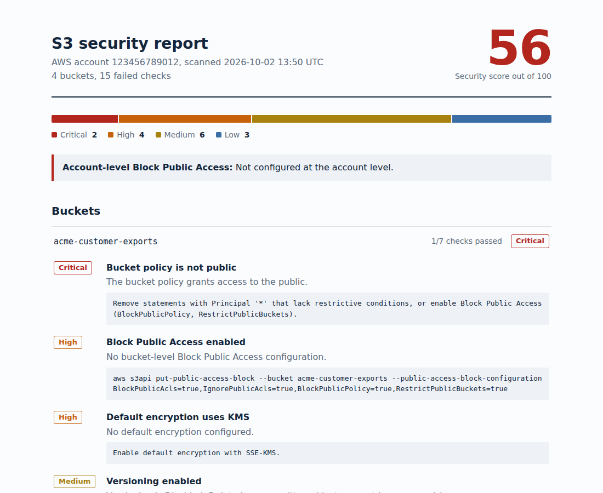

# S3 Security Scanner

A command-line tool that audits every S3 bucket in an AWS account and produces a client-ready HTML report with a security score, prioritized findings and copy-paste fixes.



[Open the full sample report](docs/sample-report.html) (generated from a mock account).

## Why

Misconfigured S3 buckets are behind many of the largest cloud data leaks. AWS shows these settings one bucket at a time across several console pages. This tool checks all buckets in all regions in seconds and tells you what to fix first.

## What it checks

| ID | Check | Severity if failed |
|---|---|---|
| S3-01 | Block Public Access enabled (all four settings) | High |
| S3-02 | Bucket policy is not public | Critical |
| S3-03 | Bucket ACL does not grant access to everyone or all AWS users | Critical |
| S3-04 | Default encryption uses KMS (SSE-S3 is reported as a warning) | High / Low |
| S3-05 | Versioning enabled (ransomware and accidental-delete protection) | Medium |
| S3-06 | Bucket policy denies plain-HTTP requests | Medium |
| S3-07 | Server access logging enabled | Low |

It also reports whether Block Public Access is enabled at the **account** level.

The score is a weighted pass rate (critical 10, high 6, medium 3, low 1), so one public bucket hurts the score far more than missing logs.

## Install

```bash
git clone https://github.com/YOUR-USER/s3-security-scanner.git
cd s3-security-scanner
pip install -e .
```

## Use

```bash
# Scan everything with your default AWS credentials
s3-scanner

# Choose a profile, specific buckets and formats
s3-scanner --profile client-audit --buckets app-data backups --format html csv json

# CI mode: exit 1 if anything HIGH or worse is found
s3-scanner --fail-on HIGH --format json
```

Example terminal output:

```
Account 123456789012: 4 buckets, score 56/100
  CRITICAL  2
  HIGH      4
  MEDIUM    6
  LOW       3
  - [CRITICAL] acme-customer-exports: Bucket policy is not public
  - [CRITICAL] acme-marketing-assets: Bucket ACL is not public
  ...

Wrote reports/s3-report-123456789012.html
Wrote reports/s3-report-123456789012.json
```

## Permissions

The scanner is **read-only**. Attach [`iam-policy.json`](iam-policy.json) to the user or role that runs it. It never reads object contents, only bucket configuration.

## How it works

- Finds each bucket's region and uses a regional client, so buckets outside `us-east-1` are checked correctly.
- Scans buckets in parallel (10 threads by default) with adaptive retries for throttling.
- Uses AWS's own public-policy evaluation, with a local policy analysis as a fallback.
- A bucket that denies access to the scanner is reported as an error instead of stopping the scan.

## Tests

The test suite runs against [moto](https://github.com/getmoto/moto), a mock of AWS, so no real account is needed.

```bash
pip install -r requirements-dev.txt
pytest -v
```

Regenerate the sample report with `PYTHONPATH=. python docs/generate_sample_report.py`.

## Roadmap

- Object Lock and lifecycle checks
- Cross-account scanning through AWS Organizations
- Slack or email summary after a scheduled run

## License

MIT
